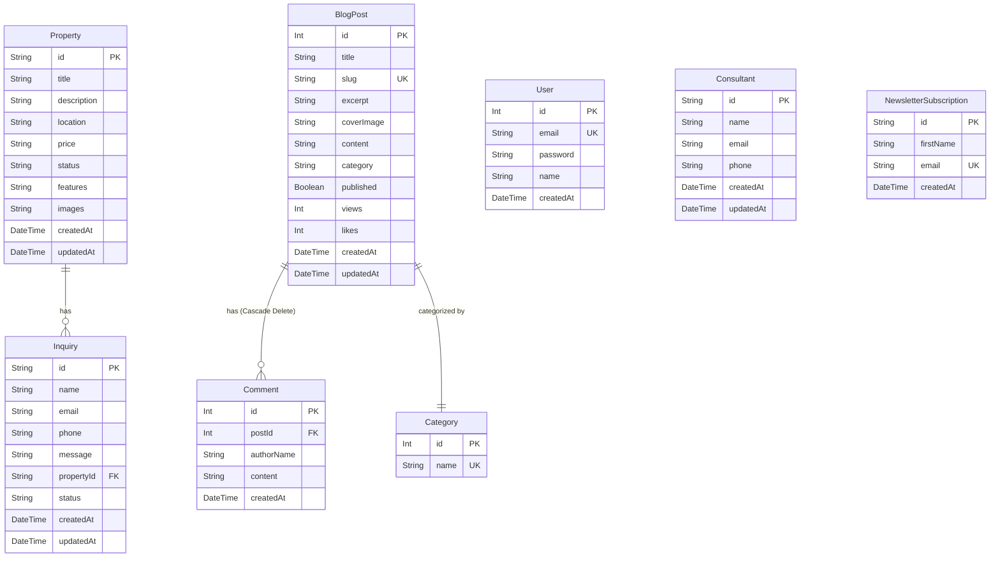

# DealRite Realty Limited - Technical Documentation

This document serves as the definitive technical reference guide for developers working on the **DealRite Realty Limited** corporate web portal. It covers architecture, directory structures, data models, API routing, and configurations.

---

## 1. Project Overview
The DealRite Realty Limited portal is a modern, high-performance web application designed for a luxury real estate agency. It serves two main purposes:
1. **Public Marketing Showcase:** Showcases property listings, handles visitor inquiries, processes newsletter registrations, and offers a public blog with dynamic sorting and search capabilities.
2. **Unified Administration Suite (`/admin/blog/new`):** A secure, tabbed administrative panel where content managers can create and edit articles, manage category selectors, moderate visitor comments, and view real-time traffic statistics (views, likes, comments).

---

## 2. Technical Stack

### Frontend
* **Core Framework:** Next.js 16.2.4 (App Router)
* **Libraries:** React 19, Framer Motion (smooth, hardware-accelerated layouts), Lucide Icons.
* **Styling:** Tailwind CSS 4 with custom variables matching corporate branding (warm golds, bright orange highlights, deep slates).

### Backend
* **Server Framework:** Next.js API Routes (Serverless & Edge Runtime integration).
* **Validation:** Zod (runtime input validation schemas).
* **Security:**
  * **Password Cryptography:** `bcryptjs` (secure hash with 10 salt rounds).
  * **Session Management:** JSON Web Token (JWT) signatures using the `jose` library.
  * **Route Protection:** Next.js 16 Edge Proxy Matcher (`src/proxy.ts`).

### Database & ORM
* **ORM:** Prisma Client ORM (Typesafe database querying).
* **Database engine:** SQLite (local development `dev.db`) configured for easy migration to MySQL (using native SQL variables in the schema model).

---

## 3. Database Schema Architecture

The database schema is defined in [schema.prisma](file:///c:/Users/Hayhonourise/Desktop/Hay-Honourise/My-Projects/AntiGravity%20Projects/DealRite%20Realty%20Limited/prisma/schema.prisma) and consists of 8 primary tables:



### Models Detail

#### 1. `User`
Used for dashboard authentication credentials.
* `id` (Int, Autoincrement, Primary Key)
* `email` (String, Unique)
* `password` (String, Bcrypt Hashed)
* `name` (String, Optional)
* `createdAt` (DateTime, Default: `now`)

#### 2. `BlogPost`
Represents articles created in the dashboard.
* `id` (Int, Autoincrement, Primary Key)
* `title` (String)
* `slug` (String, Unique, Index)
* `excerpt` (String) - Represents short snippet summaries.
* `coverImage` (String) - Core asset URL.
* `content` (String) - Retains raw HTML layout input.
* `category` (String) - Maps category tag string.
* `published` (Boolean, Default: `true`)
* `views` (Int, Default: 0) - Aggregates visits.
* `likes` (Int, Default: 0) - Aggregates client likes.
* `createdAt` (DateTime, Default: `now`)
* `updatedAt` (DateTime, Autoupdate)

#### 3. `Comment`
Visitor comments nested under articles.
* `id` (Int, Autoincrement, Primary Key)
* `postId` (Int, Foreign Key referencing `BlogPost.id` with `onDelete: Cascade`)
* `authorName` (String)
* `content` (String)
* `createdAt` (DateTime, Default: `now`)

#### 4. `Category`
Administrative category selectors.
* `id` (Int, Autoincrement, Primary Key)
* `name` (String, Unique)

#### 5. `Property`
Listing directories.
* `id` (String, UUID, Primary Key)
* `title`, `description`, `location`, `price`, `status` (String)
* `features` (String) - Stores stringified array of attributes.
* `images` (String) - Stores stringified array of asset URLs.

#### 6. `Inquiry`
Contact entries bound to properties.
* `id` (String, UUID, Primary Key)
* `name`, `email`, `phone`, `message`, `status` (String)
* `propertyId` (String, Foreign Key referencing `Property.id`, Optional)

#### 7. `NewsletterSubscription`
Mailing entries.
* `id` (String, UUID, Primary Key)
* `firstName` (String, Optional)
* `email` (String, Unique)

---

## 4. Project Directory Structure

```
├── prisma/                      # Database Configuration
│   ├── schema.prisma            # Prisma schema modeling tables and keys
│   ├── seed.ts                  # Database seeding scripts
│   └── dev.db                   # Local SQLite DB binary
├── public/                      # Static Assets (Images, Logos)
├── src/
│   ├── app/                     # App Router Architecture
│   │   ├── about/               # About Us Page
│   │   ├── admin/               # Administrative Views (Protected)
│   │   │   ├── blog/            # Admin post directories
│   │   │   │   ├── edit/        # Edit form view
│   │   │   │   └── new/         # Tabbed Control Center
│   │   ├── api/                 # App Router backend routes
│   │   │   ├── auth/            # Hashing and Token issuance
│   │   │   ├── categories/      # Category endpoints
│   │   │   ├── comments/        # Comment moderation
│   │   │   ├── inquiries/       # Property inquiries
│   │   │   ├── newsletter/      # Newsletter subscriptions
│   │   │   └── posts/           # BlogPost CRUD with interactions
│   │   ├── blog/                # Consumer Articles grid & details view
│   │   │   ├── [slug]/          # Slug detail page with Engagement Panel
│   │   ├── contact/             # Contact page
│   │   ├── faqs/                # FAQs section
│   │   ├── join/                # Consultant sign-up
│   │   ├── login/               # Portal authentication page
│   │   ├── projects/            # Property listings catalog
│   │   ├── globals.css          # Core CSS stylesheet
│   │   └── layout.tsx           # Page wrappers
│   ├── components/              # Shared Layout components
│   │   ├── Navbar.tsx           # Responsive navigation menu
│   │   └── Footer.tsx           # Branding footer section
│   ├── lib/
│   │   └── db.ts                # Global Prisma Client Singleton
│   └── proxy.ts                 # Next.js 16 Edge Proxy Interceptor
├── package.json                 # Project dependencies
└── next.config.ts               # Next.js configuration rules
```

---

## 5. Core Application Flow & API Endpoints

### Data Flows

1. **Visitor Inquiry Flow:** A user submits an inquiry form -> `POST /api/inquiries` -> saved in DB -> logs to console (ready for mailing integrations).
2. **Blog Engagement Flow:** Visitor loads a post -> Client sends background view count update -> `POST /api/posts/[id]/views`. Visitor comments -> `POST /api/posts/[id]/comments` -> client updates local view optimistically.
3. **Session Verification Flow:** Request is sent to `/admin/blog/new` -> `src/proxy.ts` Edge routing evaluates request -> checks signature of `admin_token` cookie using WebCrypto. If missing or invalid, redirects to `/login`.

### API Endpoint Registry

| Route | Method | Description | Access |
|---|---|---|---|
| `/api/auth/register` | `POST` | Registers a new dashboard administrator user (hashes password). | Public |
| `/api/auth/login` | `POST` | Checks credentials, seeds default account if table is empty, sets `admin_token` cookie. | Public |
| `/api/posts` | `GET` | Retrieves all blog posts with nested comments and comments counts. | Public |
| `/api/posts` | `POST` | Creates a new blog post. Automatically formats URL slugs and resolves slug clashing. | Admin Only |
| `/api/posts/[id]` | `PUT` | Renames or updates post content. Regenerates slug if title shifts. | Admin Only |
| `/api/posts/[id]` | `DELETE` | Removes post. Deletes all associated comments automatically. | Admin Only |
| `/api/posts/[id]/views` | `POST` | Increments views attribute by 1. | Public |
| `/api/posts/[id]/like` | `POST` | Increments likes attribute by 1. | Public |
| `/api/posts/[id]/comments` | `POST` | Creates a new Comment entry linked to the parent post. | Public |
| `/api/comments/[id]` | `DELETE` | Permanently deletes a specific comment by primary key ID. | Admin Only |
| `/api/categories` | `GET` | Fetches category lists sorted alphabetically. | Public |
| `/api/categories` | `POST` | Creates a new Category name. | Admin Only |
| `/api/categories/[id]` | `PUT` | Renames a category and bulk-updates all associated posts in a SQL transaction. | Admin Only |
| `/api/categories/[id]` | `DELETE` | Deletes a category. | Admin Only |
| `/api/inquiries` | `POST` | Creates an inquiry record. | Public |
| `/api/newsletter` | `POST` | Adds a new subscriber. | Public |

---

## 6. Configuration & Dependencies

### Environment Variables (.env)
* `DATABASE_URL`: Location URL of the sqlite DB binary or MySQL credentials (`file:./dev.db` for local SQLite development).
* `JWT_SECRET`: Secret key string used by `jose` to sign and decrypt cookies (`admin_token`).

### Key Package Dependencies
* `next (16.2.4)`: Application router environment.
* `react (19.2.4)`: Component layout framework.
* `prisma (5.22.0)`: DB ORM schema compiler.
* `@prisma/client (5.22.0)`: Runtime Typesafe DB client query engine.
* `jose`: Pure WebCrypto compliant JSON Web Token signing. Essential for Next.js Edge runtime compatibility.
* `bcryptjs`: Secure blowfish-based password hashing algorithm.
* `zod`: Schema validator checking POST objects.
* `framer-motion`: Physics-based components and layout animation handlers.
* `lucide-react`: Branding icons mapping controls.
